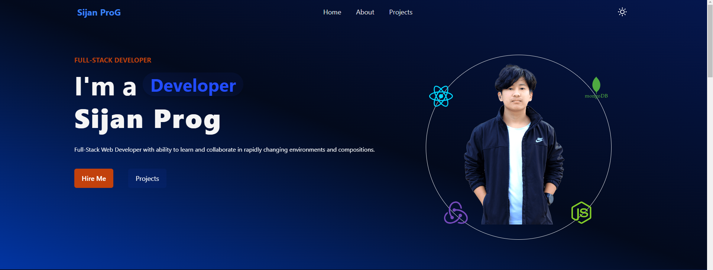
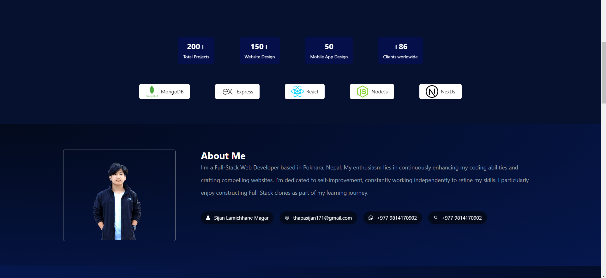
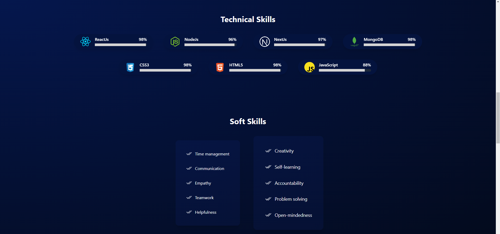
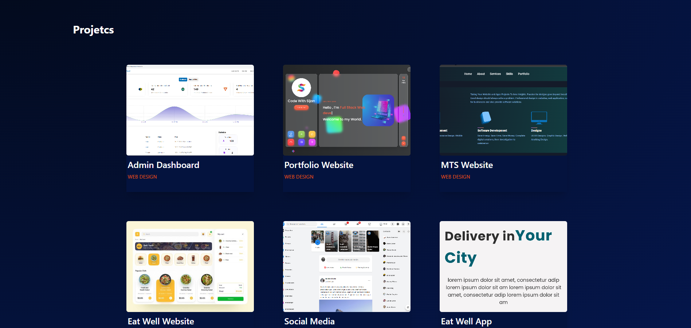
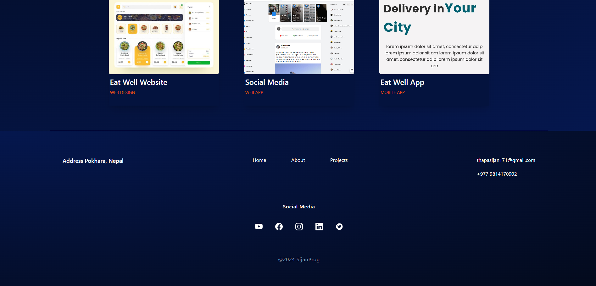

# Project Showcase Website

## About the Project

I made a website using **React** and **Tailwind CSS** to showcase my projects. This website serves as a portfolio to display the various projects I have worked on, demonstrating my skills in web development and design.

### Features
- **Responsive Design:** The website is fully responsive and looks great on all devices.
- **Modern UI:** Built with Tailwind CSS to provide a clean and modern user interface.
- **React Components:** Utilizes reusable React components for efficient development.

## About Me

Hello! I'm Sijan Thapa, a passionate web developer with a love for creating interactive and dynamic web applications. I specialize in front-end development, particularly with React, and have experience in using various CSS frameworks, including Tailwind CSS.

### Skills
- **Languages:** JavaScript, HTML, CSS, Node.js, Express, mongoDB, Sql and non Sql
- **Frameworks:** React, Tailwind CSS
- **Tools:** Git, npm, Webpack

### Contact Me
- **Email:** [thapasijan171@gmail.com](mailto:your.sijanlamichhanemagar9061@gmail.com)
- **LinkedIn:** [LinkedIn Profile](https://www.linkedin.com/in/sijanthapa171/)
- **Instagram:** [Insta Profile](https://instagram.com/sijanthapa171)

## How to Use This Project

1. **Clone the repository:**
    ```bash
    git clone https://github.com/thapasijan171/portfolio-website-main.git
    ```

2. **Navigate to the project directory:**
    ```bash
    cd portfolio-website-main
    ```

3. **Install the dependencies:**
    ```bash
    npm install
    ```

4. **Run the development server:**
    ```bash
    npm start
    ```

5. **Open your browser and visit:**
    ```plaintext
    http://localhost:3000
    ```

## License

This project is licensed under the MIT License - see the [LICENSE](https://github.com/thapasijan171/portfolio-website-main/blob/main/LICENSE) file for details.

## Acknowledgments
- **React:** A JavaScript library for building user interfaces.
- **Tailwind CSS:** A utility-first CSS framework for rapidly building custom designs.
- **Create React App:** A comfortable environment for learning React, and a great foundation for building single-page applications.


### Demo images 

<br>

<br>

<br>

<br>

